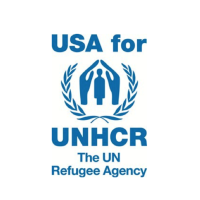
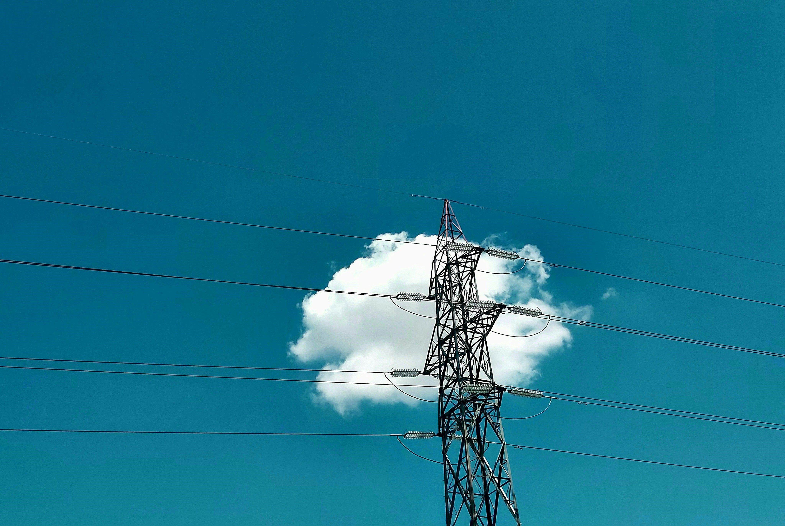
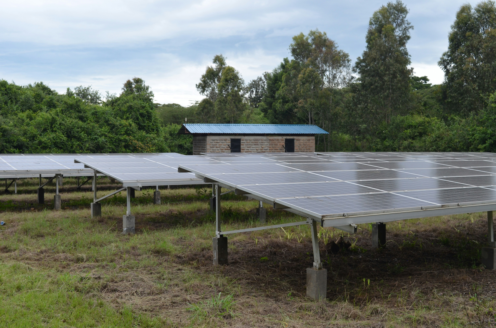

<h2 align="center" style="font-size: 2em; margin-top: 20px;">Open Source Projects at USA for UNHCR</h2>

  <!-- Logo Section -->
  

    
  

  <!-- Text Section -->
  

    The Hive is the innovation lab at USA for UNHCR. Our 
    <a href="https://github.com/USAFORUNHCRhive" style="color: #0073e6;">repositories</a> 
    use data science to enhance fundraising operations for refugees. We also collaborate on open-source projects covering a range of topics related to refugees, detailed below. We invite you to learn more about the projects listed below and to contribute. For questions, reach out at 
    <a href="mailto:hive@unrefugees.org" style="color: #0073e6;">hive@unrefugees.org</a>.
  

  <!-- First Entry -->
  

    

      
    

    

      

        Mapping electrical infrastructure in refugee camps using high-resolution drone imagery.
      

      <a href="https://github.com/USAFORUNHCRhive/turkana-grid-mapping" style="color: #0073e6;">Repository</a>  
       
      <a href="https://www.unrefugees.org/news/kakuma-and-kalobeyei-drone-imagery-and-machine-learning-for-better-planning-of-refugee-settlements/" style="color: #0073e6;">Media about this project</a>
    

  

  <!-- Second Entry -->
  

    

      
    

    

      

        Mapping buildings & solar panels in refugee camps using high-resolution drone imagery.
      

      <a href="https://github.com/USAFORUNHCRhive/turkana-camp-roof-mapping" style="color: #0073e6;">Repository</a>  
       
      <a href="https://www.unrefugees.org/news/kakuma-and-kalobeyei-drone-imagery-and-machine-learning-for-better-planning-of-refugee-settlements/" style="color: #0073e6;">Media about this project</a>
    

  

